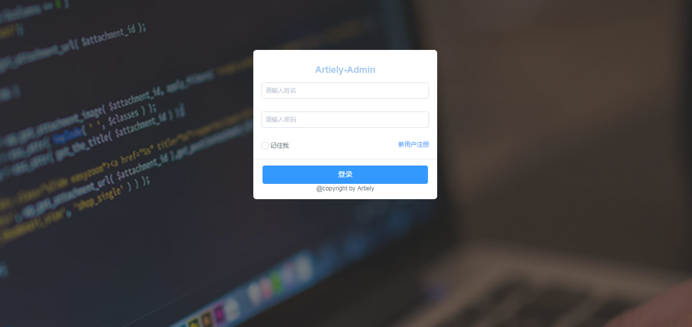
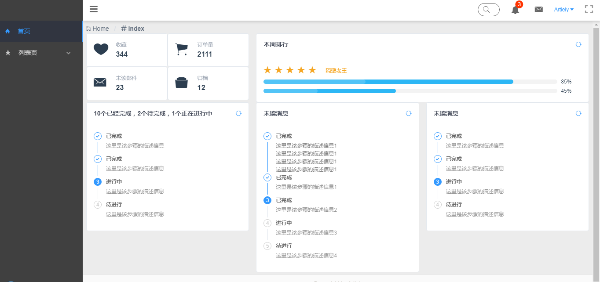
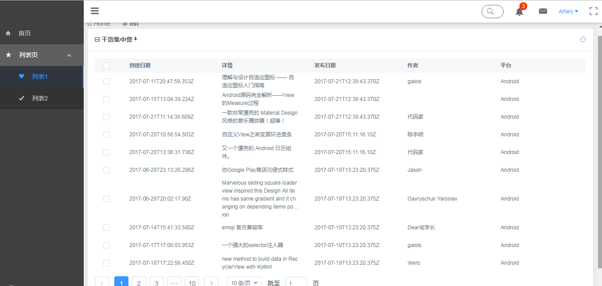
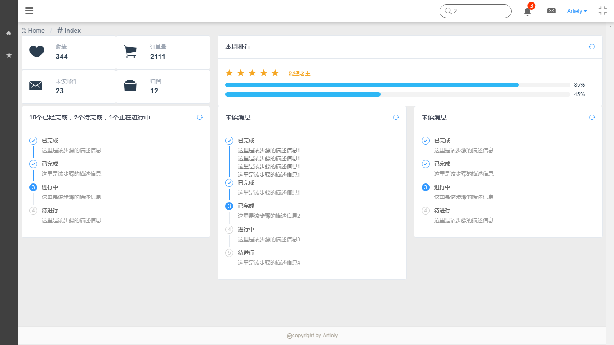

# vue-admin-artiely

> vue-admin by iview






## 技术栈
 vue 
 vue-cli
 vuex 
 vue-router 
 axios 

## 项目结构
```javascript
├─build                 //打包环境
│      
├─config                //开发部署配置
│      
├─node_modules
│  
├─src                   //项目源文件
│  │  main.js           //入口文件       
│  ├─api                //请求资源
│  │      
│  ├─assets             //组件静态资源
│  │  └─styles          //样式
│  │      ├─base        //基础样式
│  │      ├─cover       //iview覆盖样式
│  │      ├─layout      //布局样式
│  │      └─variable    //样式变量
│  │              
│  ├─common             //公共
│  │  ├─directive       
│  │  └─utils           
│  │              
│  ├─components     
│  │  │  
│  │  ├─layout          //布局组件
│  │  │      Theader.vue
│  │  │      Nav.vue
│  │  ├─pages           //基本组件
│  │  │      404.vue
│  │  │      500.vue
│  │  │      Login.vue
│  │  │      
│  │  └─views           //业务组件
│  │          
│  ├─router             //路由管理
│  │      
│  └─store              //状态管理
│              
├─static                //业务静态资源
│  └─img
│          
└─test
    ├─e2e
    │  │  nightwatch.conf.js
    │  │  runner.js
    │  │  
    │  ├─custom-assertions
    │  │      elementCount.js
    │  │      
    │  └─specs
    │          test.js
    │          
    └─unit
        │  .eslintrc
        │  index.js
        │  karma.conf.js
        │  
        └─specs
                Hello.spec.js
│  .babelrc
│  .editorconfig
│  .gitignore
│  .postcssrc.js
│  index.html           //项目首页
│  package.json         //依赖配置
│  prod.server.js       //打包后启动文件             
```
## Build Setup

``` bash
# install dependencies
npm install

# serve with hot reload at localhost:8080
npm run dev

# build for production with minification
npm run build

# build for production and view the bundle analyzer report
npm run build --report

# run unit tests
npm run unit

# run e2e tests
npm run e2e

# run all tests
npm test
```

For detailed explanation on how things work, checkout the [guide](http://vuejs-templates.github.io/webpack/) and [docs for vue-loader](http://vuejs.github.io/vue-loader).
