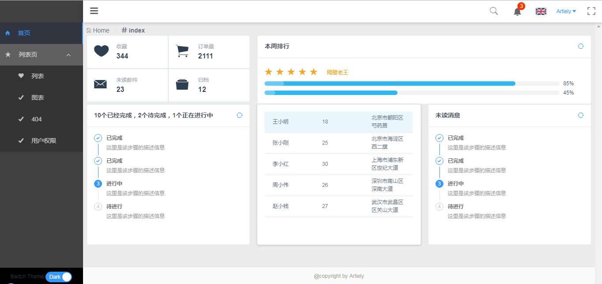
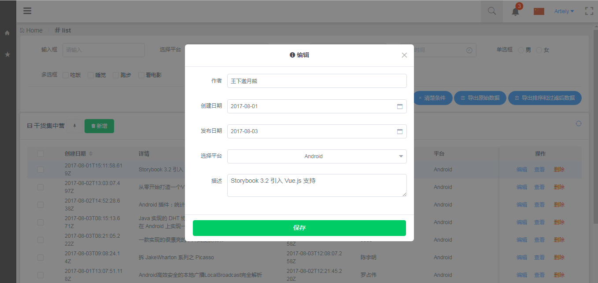
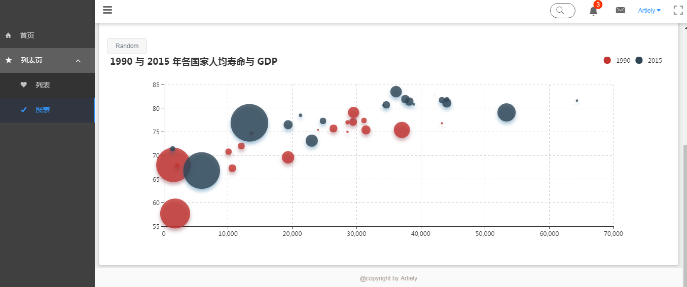
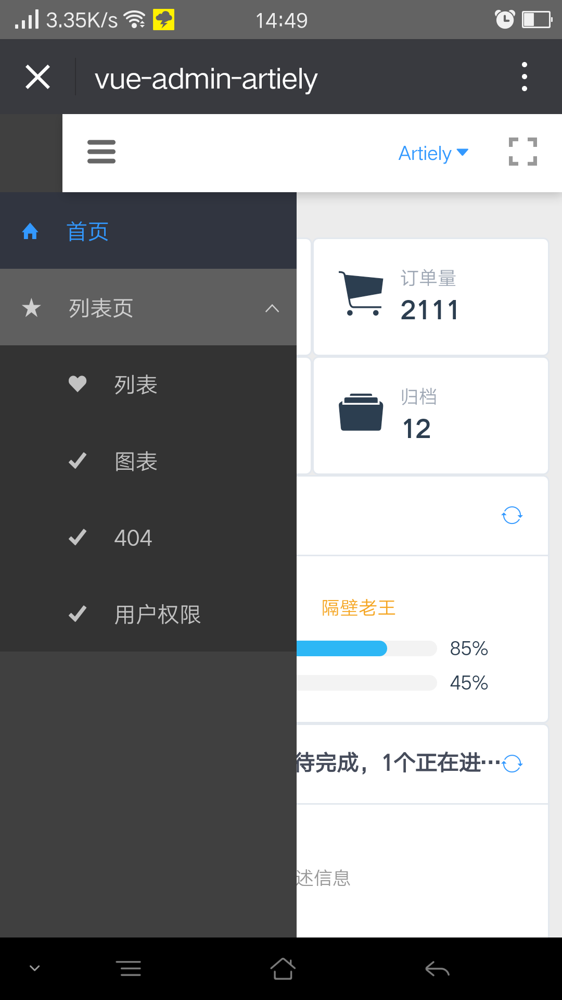
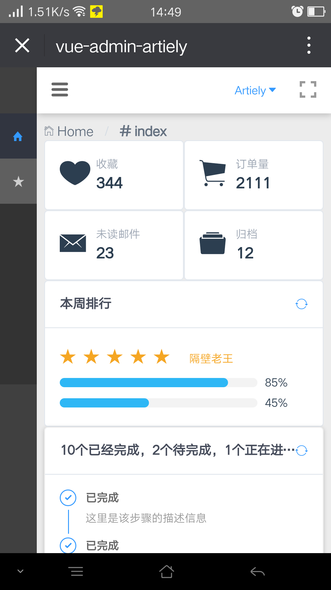

# vue-admin-artiely

> vue-admin by iview

> 目前还是只是一个管理系统模板 ，持续更新完善中，欢迎提意见，模板更新完成后 会用node写后端，如果对您有帮助，您可以点右上角 "Star" 支持一下 谢谢！ ^_^
## 项目截图
### 登录

### 首页

### 主题切换

### 搜索

### 编辑

### 图表

### 响应式



## 技术栈
 > vue 

 > vue-cli

 > vuex 

 > vue-router 

 > axios 

 > i18n

 > es6/7

 > webpack2/3

 > less

 > ...

## 项目结构
```bash
├─build                 // 打包环境
│      
├─config                // 开发部署配置
│      
├─node_modules
│  
├─src                   // 项目源文件
│  │  main.js           // 入口文件
│  ├─api                // 请求接口
│  │      
│  ├─assets             // 组件静态资源
│  │  └─styles          // 样式
│  │      ├─base        // 基础样式
│  │      ├─cover       // iview覆盖样式
│  │      ├─layout      // 布局样式
│  │      └─variable    // 样式变量
│  │              
│  ├─common             // 公共
│  │  ├─directive       
│  │  └─utils           
│  │  
│  ├─i18n               // 国际化
│  ├─components     
│  │  │  
│  │  ├─layout          // 布局组件
│  │  │      Theader.vue
│  │  │      Nav.vue
│  │  ├─pages           // 基本组件
│  │  │      E404.vue
│  │  │      Login.vue
│  │  │      
│  │  └─views           // 业务组件
│  │          
│  ├─router             // 路由管理
│  │      
│  └─store              // 状态管理
│              
├─static                // 业务静态资源
│  └─img
│          
└─test                  // 测试
    ├─e2e
    │  │  nightwatch.conf.js
    │  │  runner.js
    │  │  
    │  ├─custom-assertions
    │  │      elementCount.js
    │  │      
    │  └─specs
    │          test.js
    │          
    └─unit
        │  .eslintrc
        │  index.js
        │  karma.conf.js
        │  
        └─specs
                Hello.spec.js
│  .babelrc             // babel配置
│  .editorconfig        // editor配置
│  .gitignore           // git忽略配置
│  .eslintrc.js         // eslint配置
│  .postcssrc.js        // postcss配置
│  index.html           // 项目首页
│  package.json         // 依赖配置
│  prod.server.js       // 打包后启动文件
```

> 代码默认遵循eslint(default)的规范 不习惯的可以在webpack.base.conf.js 关闭相应规则

## 浏览器支持

* IE 9+
* Firefox（最新）
* Chrome（最新）
* Safari（最新）

## Build Setup

``` bash
# install dependencies
npm install

# serve with hot reload at localhost:8080
npm run dev

# build for production with minification
npm run build

# build for production and view the bundle analyzer report
npm run build --report

# run unit tests
npm run unit

# run e2e tests
npm run e2e

# run all tests
npm test
```

For detailed explanation on how things work, checkout the [guide](http://vuejs-templates.github.io/webpack/) and [docs for vue-loader](http://vuejs.github.io/vue-loader).
